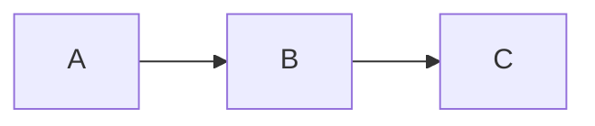

# How to Use Glacimark

Glacimark is a desktop markdown viewer with Mermaid diagram support. It lets you browse, read, and navigate markdown files with live-rendered diagrams.

Want to see all the markdown features in action? Check out the [Rendering Museum](test.md) — it showcases every rendering capability in one place.

---

## Getting Started

When you first launch the app, it opens the default `docs/` folder and automatically selects the first file.

To open a different folder, click the **folder button** in the sidebar header. A native file picker dialog will let you choose any directory on your system. The app remembers your last selected folder across sessions.

### Opening Files from Outside the App

You can open `.md` files directly from Windows:

- **Right-click** a `.md` file in File Explorer → **Open with** → choose **Glacimark**
- **Command line:** run `glacimark path\to\file.md` from any terminal (after installing via the NSIS installer, which adds `glacimark` to your PATH)
- **Drag-and-drop** a `.md` file onto `glacimark.exe`

When you open a file this way, the app automatically sets the file's parent directory as the active folder in the sidebar.

If Glacimark is already running and you open another file (via right-click, CLI, etc.), the existing window receives the file — no duplicate windows are created.

---

## Sidebar

The sidebar on the left shows all `.md` files in the current folder. Directories that contain markdown files are shown as expandable folders.

### Navigating Files

- **Click** a file to view it in the main content area
- **Click** a folder to expand/collapse it
- **Arrow keys** navigate the file tree — files load immediately on focus, directories expand/collapse with Enter
- The last selected file is remembered when you relaunch the app

### Sort Controls

Click the **sort button** (next to the folder button) to cycle through sort modes:

| Button Label | Sort Order |
|---|---|
| **A-Z** | Alphabetical (default) |
| **Z-A** | Reverse alphabetical |
| **Newest** | Most recently modified first |
| **Oldest** | Least recently modified first |

Directories always appear before files regardless of sort mode. Your chosen sort mode is remembered across sessions.

### Filter Files

Type in the **filter bar** below the sidebar header to narrow down files by name. The filter is instant and case-insensitive — only files whose names match your query are shown. Directories are kept if they contain matching files. Clear the input to see all files again.

### Full-Text Search

Click the **🔍** button next to the filter bar to switch to full-text search mode. In this mode, the input searches the **contents** of all markdown files in the current folder.

- Results appear in the sidebar, grouped by file, with matching lines and line numbers
- The search is **case-insensitive** and **debounced** (300ms delay) so it doesn't search on every keystroke
- Click a result line to open that file and **highlight the matching text** with a temporary amber flash that fades out
- Click a file name header to open the file without highlighting
- Click the **🔍** button again to return to filename filter mode
- Hidden directories and non-markdown files are excluded from search

### Creating New Files

You can create new markdown files directly from within Glacimark:

- Click the **+** button in the sidebar header, or press **Ctrl+N**
- An inline input appears pre-filled with `untitled.md` — the "untitled" portion is selected so you can immediately type a new name
- Press **Enter** or click the **checkmark button** next to the input to create the file, or **Escape** to cancel
- The `.md` extension is added automatically if you omit it
- The new file is created with a `# Title` heading derived from the filename (hyphens and underscores become spaces, words are title-cased)
- After creation, the file opens immediately in **edit mode** so you can start writing

**Target directory:** If you have a directory focused in the file tree (via arrow keys), the new file is created inside that directory. Otherwise, it's created in the root docs folder.

If the filename already exists, a red error message appears below the input — fix the name and try again.

### Renaming Files

You can rename markdown files directly from the sidebar:

- **F2** — press while a file is focused in the tree to start renaming
- **Right-click** a file — a context menu appears with a "Rename" option
- The filename turns into an editable input with the name selected (before `.md`)
- Type the new name and press **Enter** to confirm, or **Escape** to cancel
- The `.md` extension is added automatically if you omit it
- If a file with that name already exists, a red error message appears inline — fix the name and try again
- All open panes showing the renamed file update automatically

### Deleting Files

You can delete markdown files directly from the sidebar:

- **Delete key** — press while a file is focused in the tree to delete it
- **Right-click** a file — a context menu appears with a "Delete" option
- A native OS confirmation dialog asks you to confirm before the file is moved to the Recycle Bin
- Any open panes showing the deleted file are automatically closed
- You can **undo** the deletion with **Ctrl+Z** to restore the file and its contents

### Copy Path

You can copy the full path of any file or folder to the clipboard:

- **Right-click** a file or folder in the sidebar — the context menu includes a "Copy Path" option
- The full file system path is copied to your clipboard

### Save As

You can save a copy of any file under a new name or location:

- **Ctrl+Shift+S** — saves the active pane's file via a native Save As dialog
- **Right-click** a file in the sidebar — the context menu includes a "Save As" option
- **Save As button** in the pane header — the download icon button (between the copy-path and close buttons)
- After saving, the pane switches to the new file path

### Current Folder Display

The sidebar shows the name of the currently active folder just below the "Files" header. Hover over it to see the full path in a tooltip.

### Multi-File Viewing

You can view multiple files side by side in split panes:

- **Ctrl+Click** a file in the sidebar to open it in a **new pane** (up to 4 panes)
- **Click** a file normally to replace the content in the active pane
- **Close** a pane with the **×** button on its tab header
- **Ctrl+W** closes the active pane
- **Ctrl+1/2/3/4** switches between open panes

The active pane is highlighted with a blue filename tab. Your open panes are remembered across sessions.

### Help Button

Click the **?** button to open this guide at any time, no matter what folder you're currently viewing.

---

## Jump List (Windows Taskbar)

When you right-click the Glacimark icon in the Windows taskbar, a **Recent Folders** category shows the folders you've recently opened. Click any folder to instantly switch to it.

- Folders are added to the jump list whenever you open or switch to a new folder
- The list holds up to 10 recent folders (most recent first)
- Stale entries (folders that no longer exist) are automatically cleaned up on app launch
- If the app is already running, clicking a jump list folder switches the existing window to that folder

---

## Multiple Windows

You can open multiple independent windows, each with its own sidebar, folder, and panes:

- **File > New Window** or **Ctrl+Shift+N** — opens a new window
- **Taskbar:** right-click the Glacimark icon and click "Glacimark" to open a new window
- Each window operates independently — browse different folders, open different files, use different pane layouts
- File changes are synced across all windows (editing a file in one window updates it in all others)
- The app quits when the last window is closed

**Note:** All windows share the same localStorage, so theme and folder preferences are shared. The last window to save a setting wins.

---

## Reading Layout

The markdown viewer has two reading layout modes, toggled with buttons in the top-right corner of the content area:

| Button | Mode | Description |
|---|---|---|
| **≡** | **Single Column** (default) | Content capped at 800px wide, centered. Best for comfortable reading. |
| **⊞** | **Multi-Column** | Content flows into newspaper-style columns. Great for widescreen/ultrawide monitors. |

Your chosen layout is remembered across sessions.

### Source Line Numbers

Click the **1:** button in the top-right corner to toggle source line numbers. When enabled, each block-level element (headings, paragraphs, code blocks, lists, tables, blockquotes, horizontal rules) shows its original source line number in the left gutter.

This is useful for:

- Correlating rendered content with search result line numbers
- Discussing specific parts of a document by line reference
- Debugging markdown formatting issues

The toggle state is remembered across sessions.

---

## Find & Replace

In edit mode, press **Ctrl+F** to open the find panel, or **Ctrl+H** for find & replace. The search panel is fully themed to match both Aurora and Glacier themes.

- Type a search term to highlight all matches in the editor
- Use the arrow buttons or Enter to jump between matches
- **Ctrl+H** shows the replace field — replace one match or all matches at once
- Press **Escape** to close the search panel

---

## Wiki-style Links

Glacimark supports `[[wiki-style links]]` for easy cross-file navigation. Instead of writing `[Notes](notes.md)`, you can write `[[notes]]`.

| Syntax | Rendered As |
|---|---|
| `[[filename]]` | Link to `filename.md` |
| `[[filename.md]]` | Link to `filename.md` (no double extension) |
| `[[filename\|Display Text]]` | Link showing "Display Text" |

Wiki-links render with a **purple dashed underline** to distinguish them from regular markdown links. Clicking a wiki-link opens the target file, and Ctrl+Click opens it in a new pane.

Wiki-link syntax inside code blocks or inline code is left as-is (not rendered as a link).

### Backlinks

When other files in the current folder link to the current file using wiki-links, a **backlinks panel** appears at the bottom of the viewer. Click the collapsed "N backlinks" header to expand it and see which files reference the current file, with context lines.

Clicking a file name in the backlinks panel navigates to that file. Backlinks are not shown for embedded docs (help, museum).

---

## Viewing Markdown

The main content area renders your markdown with full formatting support:

- **Headings, lists, tables, blockquotes** — standard markdown
- **Code blocks** — syntax highlighted with highlight.js, with line numbers in the left gutter
- **Links** — clickable
- **Anchor links** — `#hash` links (e.g. `[Go to top](#top)`) smooth-scroll to the matching heading within the document. Tables of contents, cross-references, and "Back to top" links all work. Headings automatically get GitHub-flavored IDs (lowercased, spaces become hyphens, special characters stripped). Duplicate headings get `-1`, `-2` suffixes.
- **File links** — clicking a `.md` link (e.g. `[see notes](notes.md)`) opens that file in the active pane. Ctrl+Click opens it in a new pane. Links with `#section` fragments (e.g. `guide.md#installation`) open the file and scroll to the heading. Relative paths (`../sibling/file.md`, `sub/deep.md`) are resolved correctly.
- **External links** — clicking an `http://` or `https://` link opens it in your system browser instead of navigating inside the app
- **Mermaid diagrams** — rendered as live SVG diagrams

### ASCII Art Diagrams (svgbob)

Fenced code blocks tagged with `bob`, `svgbob`, or `ascii-diagram` are rendered as clean SVG graphics using svgbob. This works great for file trees, box layouts, and other ASCII art:

~~~
```bob
+--+--+
|  |  |
+--+--+
```
~~~

**Auto-detection:** Unlabeled code blocks that contain Unicode box-drawing characters (`┌ ┐ └ ─ │ ├ →` etc.) are automatically rendered as SVG diagrams — no tag needed. This means existing markdown with ASCII art layouts or file trees just works.

Unicode box-drawing characters (`├`, `└`, `─`, `│`, etc.) are automatically converted to svgbob-compatible equivalents before rendering.

### Mermaid Diagrams

Fenced code blocks with the `mermaid` language tag are automatically rendered as diagrams:

~~~

~~~

Supported diagram types include flowcharts, sequence diagrams, class diagrams, state diagrams, ER diagrams, Gantt charts, pie charts, and more. See the [Mermaid documentation](https://mermaid.js.org/) for syntax details.

**Error handling:** If a mermaid block has invalid syntax, Glacimark shows a red-bordered error overlay with the specific error message instead of a blank space. The raw mermaid source is kept visible below the error so you can diagnose and fix the problem. A status indicator in the viewer header shows how many diagrams rendered successfully (e.g. "3 diagrams OK" or "1 of 3 diagrams failed").

**Editor linting:** In edit mode, mermaid blocks with invalid syntax get a **red wavy underline** directly in the code editor. Hover over the underline to see the specific error message in a tooltip. The lint gutter also shows error markers next to broken blocks. This gives you immediate feedback while typing — no need to switch to view mode to check for errors.

**Auto-fix:** Glacimark can automatically repair common mermaid syntax mistakes — missing diagram type declarations, single-dash arrows (`->` instead of `-->`), bare `graph`/`flowchart` without a direction, and unclosed `subgraph` blocks.

- **In view mode:** When diagrams fail, the status badge shows a "Try Auto-Fix" link. Click it to fix the file on disk and reload.
- **In edit mode:** Click the wrench button (🔧) in the editor toolbar, or press **Ctrl+Shift+F**, to fix all mermaid blocks in the current file.
- A toast notification confirms how many issues were fixed (or that none were found).

---

## Editing Markdown

Glacimark includes a built-in split-pane editor so you can edit files without leaving the app.

### Entering Edit Mode

Each pane header has a **view/edit toggle** — an eye icon (view) and a pencil icon (edit). The active mode is highlighted. Click the pencil to enter edit mode, or press **Ctrl+E** to toggle the active pane.

### Split Editor

In edit mode, the pane splits in two:

- **Left side** — a CodeMirror text editor with syntax highlighting and line numbers
- **Right side** — a live preview that updates as you type (including Mermaid diagrams)

### Scroll Sync & Active Line

The editor and preview panes stay in sync as you work:

- **Scroll sync** — scrolling either pane (editor or preview) proportionally scrolls the other
- **Active line highlight** — as you move your cursor in the editor, the corresponding rendered element in the preview is highlighted with a subtle blue border
- **Table cell targeting** — when your cursor is on a table row, the preview highlights the specific cell under the cursor, not just the first cell in the row

### Saving

- **Auto-save** — changes are saved to disk automatically 1 second after you stop typing
- **Ctrl+S** — saves immediately (and cancels the auto-save timer)
- **Ctrl+Shift+S** — opens a native Save As dialog to save a copy of the current file under a new name or location. After saving, the pane switches to the new file.

### Pasting and Dropping Images

You can insert images directly into the editor:

- **Paste from clipboard** — take a screenshot or copy an image, then **Ctrl+V** in the editor. The image is saved to an `assets/` subfolder next to your markdown file, and a `` reference is inserted at the cursor.
- **Drag and drop** — drag an image file from File Explorer onto the editor. The image is saved the same way, and the markdown reference is inserted at the drop position.

Supported formats: PNG, JPG/JPEG, GIF, WebP. Images are saved with auto-generated filenames (timestamp + random ID) to avoid collisions.

### Navigating While Editing

Clicking a file in the sidebar while in edit mode loads the new file into the editor — you stay in edit mode. Click the eye icon or press **Ctrl+E** to return to view mode.

### Multi-Pane Editing

Each pane toggles independently. You can have one pane in edit mode and another in view mode.

---

## Themes

Glacimark has two built-in themes:

| Theme | Description |
|---|---|
| **Aurora** (default) | Dark theme inspired by the northern lights — deep blue backgrounds with cool-toned syntax colors |
| **Glacier** | Light theme with a crisp, icy palette — bright backgrounds with warm accents |

Click the **sun/moon button** (☀️/🌙) in the sidebar header to toggle between themes. Your choice is remembered across sessions.

The theme also affects Mermaid diagrams, ASCII art (svgbob), code syntax highlighting, and the editor. Everything stays consistent.

**Startup behavior:** The app remembers your last theme and sets the native window background color to match before anything is visible — no white flash on launch regardless of which theme you use.

---

## Undo / Redo

Glacimark tracks file operations so you can undo mistakes:

- **Ctrl+Z** — undo the last operation (create, delete, rename, move, or save)
- **Ctrl+Shift+Z** or **Ctrl+Y** — redo the last undone operation

Supported operations: creating files/folders, deleting files/folders, renaming, moving (drag-and-drop), and file saves.

**Editor vs. app undo:** When the CodeMirror editor is focused, Ctrl+Z uses the editor's built-in character-level undo. When the editor is not focused, Ctrl+Z undoes the last app-level file operation.

**Recycle Bin:** Deleted files are moved to the Recycle Bin (not permanently deleted), giving you a safety net beyond the undo stack.

**Session-only:** The undo history is kept in memory and is cleared when you restart the app or switch to a different folder.

---

## Live File Watching

Glacimark watches your folder for changes in real time. If you edit a markdown file in another editor (or if a tool like Claude Code writes files), the sidebar and content area update automatically — no refresh needed.

---

## Table of Contents

Press **Ctrl+T** to toggle the Table of Contents pane. The TOC appears as a dedicated panel on the left side of the content area (next to your file panes), auto-generated from the headings in the currently active file.

- **Click** any heading in the TOC to scroll the viewer to that section
- The **active heading** (the one currently visible in the viewport) is highlighted in the TOC — after clicking a TOC entry, the highlight stays stable during the smooth scroll (no jitter)
- **Switch panes** and the TOC updates to reflect the new pane's headings
- The TOC pane does **not** count toward the 4-pane limit — it's a utility panel
- **Close** the TOC with the **x** button on its header, or press **Ctrl+T** again
- TOC visibility is remembered across sessions

---

## Document Statistics

Press **Ctrl+I** to toggle the document statistics footer bar. When visible, a slim bar appears at the bottom of the viewer showing:

- **Word count** — total words (after stripping markdown syntax, code blocks, and frontmatter)
- **Character count** — total characters, and characters excluding spaces
- **Lines** — total lines in the raw markdown source
- **Sentences** — detected via terminal punctuation (`.`, `!`, `?`)
- **Paragraphs** — groups of text separated by blank lines
- **Reading time** — estimated minutes at 200 words per minute
- **FRE** — Flesch Reading Ease score (0-100; higher = easier to read)
- **FK** — Flesch-Kincaid Grade Level (approximate US school grade level)

Hover over the FRE and FK scores for a tooltip explaining the scales.

You can also toggle the stats bar via the **Aa** button in the viewer header (next to the line numbers toggle). The toggle state is remembered across sessions.

**Note:** The stats bar only appears in view mode, not in edit mode. When you switch between files, the stats update automatically.

---

## Zoom

You can zoom the text content in and out for readability. Zoom applies to both the markdown viewer and the code editor.

- **Ctrl+=** or **Ctrl++** — zoom in
- **Ctrl+-** — zoom out
- **Ctrl+0** — reset to 100%
- **Ctrl+Mouse Wheel** — scroll up to zoom in, scroll down to zoom out

The zoom range is 50% to 200%, in 10% steps. Your zoom level is shown as a percentage in the viewer header when not at 100%, and is remembered across sessions.

Mermaid and svgbob diagrams keep their native size — only text content scales.

---

## Keyboard Shortcuts

| Key | Action |
|---|---|
| **Up/Down Arrow** | Navigate file tree (auto-selects files) |
| **Enter** | Expand/collapse focused directory |
| **Tab** | Move focus between sidebar and content |
| **F2** | Rename focused file |
| **Delete** | Delete focused file (with confirmation) |
| **Ctrl+N** | Create a new markdown file |
| **Ctrl+E** | Toggle edit/view mode on active pane |
| **Ctrl+F** | Find in editor (edit mode) |
| **Ctrl+H** | Find & Replace in editor (edit mode) |
| **Ctrl+S** | Save immediately (in edit mode) |
| **Ctrl+Shift+S** | Save As — save a copy with a new name/location |
| **Ctrl+I** | Toggle document statistics footer |
| **Ctrl+T** | Toggle Table of Contents panel |
| **Ctrl+V** (with image) | Paste image from clipboard into editor |
| **Ctrl+Shift+F** | Auto-fix mermaid diagrams (in edit mode) |
| **Ctrl+Z** | Undo last file operation (create, delete, rename, move, save) |
| **Ctrl+Shift+Z** / **Ctrl+Y** | Redo last undone operation |
| **Ctrl+Shift+N** | Open a new window |
| **Ctrl+Click** | Open file in a new pane |
| **Ctrl+W** | Close active pane |
| **Ctrl+1/2/3/4** | Switch to pane 1, 2, 3, or 4 |
| **Ctrl+=** / **Ctrl++** | Zoom in |
| **Ctrl+-** | Zoom out |
| **Ctrl+0** | Reset zoom to 100% |

---

## Tips

- **Widescreen monitors:** Use the layout toggle (top-right of the content area) to switch between centered and multi-column modes.
- **Multiple folders:** Use the folder button to switch between different documentation directories. Each folder's state is independent.
- **CLI usage:** After installing with the NSIS installer, run `glacimark` from any terminal to launch the app, or `glacimark file.md` to open a specific file.
- **Rendering museum:** Open [the Rendering Museum](test.md) to see every rendering feature in one place — headings, code blocks, Mermaid diagrams, ASCII art, tables, images, anchor links, and more. Great for verifying everything works after updates.
- **Dogfooding:** Glacimark's own documentation lives in the `docs/` folder — you're reading it right now!
