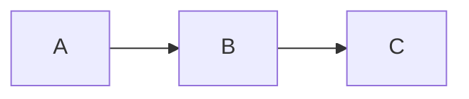

# How to Use Planning Central

Planning Central is a desktop markdown viewer with Mermaid diagram support. It lets you browse, read, and navigate markdown files with live-rendered diagrams.

---

## Getting Started

When you first launch the app, it opens the default `docs/` folder and automatically selects the first file.

To open a different folder, click the **folder button** in the sidebar header. A native file picker dialog will let you choose any directory on your system. The app remembers your last selected folder across sessions.

---

## Sidebar

The sidebar on the left shows all `.md` files in the current folder. Directories that contain markdown files are shown as expandable folders.

### Navigating Files

- **Click** a file to view it in the main content area
- **Click** a folder to expand/collapse it
- **Arrow keys** navigate the file tree — files load immediately on focus, directories expand/collapse with Enter
- The last selected file is remembered when you relaunch the app

### Sort Controls

Click the **sort button** (next to the folder button) to cycle through sort modes:

| Button Label | Sort Order |
|---|---|
| **A-Z** | Alphabetical (default) |
| **Z-A** | Reverse alphabetical |
| **Newest** | Most recently modified first |
| **Oldest** | Least recently modified first |

Directories always appear before files regardless of sort mode. Your chosen sort mode is remembered across sessions.

### Filter Files

Type in the **filter bar** below the sidebar header to narrow down files by name. The filter is instant and case-insensitive — only files whose names match your query are shown. Directories are kept if they contain matching files. Clear the input to see all files again.

### Help Button

Click the **?** button to open this guide at any time, no matter what folder you're currently viewing.

---

## Viewing Markdown

The main content area renders your markdown with full formatting support:

- **Headings, lists, tables, blockquotes** — standard markdown
- **Code blocks** — syntax highlighted with highlight.js
- **Links** — clickable
- **Mermaid diagrams** — rendered as live SVG diagrams

### Mermaid Diagrams

Fenced code blocks with the `mermaid` language tag are automatically rendered as diagrams:

~~~

~~~

Supported diagram types include flowcharts, sequence diagrams, class diagrams, state diagrams, ER diagrams, Gantt charts, pie charts, and more. See the [Mermaid documentation](https://mermaid.js.org/) for syntax details.

---

## Live File Watching

Planning Central watches your folder for changes in real time. If you edit a markdown file in another editor (or if a tool like Claude Code writes files), the sidebar and content area update automatically — no refresh needed.

---

## Keyboard Shortcuts

| Key | Action |
|---|---|
| **Up/Down Arrow** | Navigate file tree (auto-selects files) |
| **Enter** | Expand/collapse focused directory |
| **Tab** | Move focus between sidebar and content |

---

## Tips

- **Widescreen monitors:** Content currently stretches to fill the available width. A reading layout feature is planned.
- **Multiple folders:** Use the folder button to switch between different documentation directories. Each folder's state is independent.
- **Dogfooding:** Planning Central's own documentation lives in the `docs/` folder — you're reading it right now!
