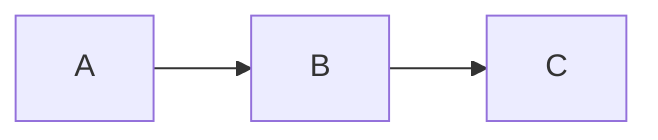

# How to Use Polar Markdown

Polar Markdown is a desktop markdown viewer with Mermaid diagram support. It lets you browse, read, and navigate markdown files with live-rendered diagrams.

---

## Getting Started

When you first launch the app, it opens the default `docs/` folder and automatically selects the first file.

To open a different folder, click the **folder button** in the sidebar header. A native file picker dialog will let you choose any directory on your system. The app remembers your last selected folder across sessions.

### Opening Files from Outside the App

You can open `.md` files directly from Windows:

- **Right-click** a `.md` file in File Explorer → **Open with** → choose **Polar Markdown**
- **Command line:** run `polarmd path\to\file.md` from any terminal (after installing via the NSIS installer, which adds `polarmd` to your PATH)
- **Drag-and-drop** a `.md` file onto `polarmd.exe`

When you open a file this way, the app automatically sets the file's parent directory as the active folder in the sidebar.

If Polar Markdown is already running and you open another file (via right-click, CLI, etc.), the existing window receives the file — no duplicate windows are created.

---

## Sidebar

The sidebar on the left shows all `.md` files in the current folder. Directories that contain markdown files are shown as expandable folders.

### Navigating Files

- **Click** a file to view it in the main content area
- **Click** a folder to expand/collapse it
- **Arrow keys** navigate the file tree — files load immediately on focus, directories expand/collapse with Enter
- The last selected file is remembered when you relaunch the app

### Sort Controls

Click the **sort button** (next to the folder button) to cycle through sort modes:

| Button Label | Sort Order |
|---|---|
| **A-Z** | Alphabetical (default) |
| **Z-A** | Reverse alphabetical |
| **Newest** | Most recently modified first |
| **Oldest** | Least recently modified first |

Directories always appear before files regardless of sort mode. Your chosen sort mode is remembered across sessions.

### Filter Files

Type in the **filter bar** below the sidebar header to narrow down files by name. The filter is instant and case-insensitive — only files whose names match your query are shown. Directories are kept if they contain matching files. Clear the input to see all files again.

### Full-Text Search

Click the **🔍** button next to the filter bar to switch to full-text search mode. In this mode, the input searches the **contents** of all markdown files in the current folder.

- Results appear in the sidebar, grouped by file, with matching lines and line numbers
- The search is **case-insensitive** and **debounced** (300ms delay) so it doesn't search on every keystroke
- Click a result line to open that file and **highlight the matching text** with a temporary amber flash that fades out
- Click a file name header to open the file without highlighting
- Click the **🔍** button again to return to filename filter mode
- Hidden directories and non-markdown files are excluded from search

### Creating New Files

You can create new markdown files directly from within Polar Markdown:

- Click the **+** button in the sidebar header, or press **Ctrl+N**
- An inline input appears pre-filled with `untitled.md` — the "untitled" portion is selected so you can immediately type a new name
- Press **Enter** or click the **checkmark button** next to the input to create the file, or **Escape** to cancel
- The `.md` extension is added automatically if you omit it
- The new file is created with a `# Title` heading derived from the filename (hyphens and underscores become spaces, words are title-cased)
- After creation, the file opens immediately in **edit mode** so you can start writing

**Target directory:** If you have a directory focused in the file tree (via arrow keys), the new file is created inside that directory. Otherwise, it's created in the root docs folder.

If the filename already exists, a red error message appears below the input — fix the name and try again.

### Renaming Files

You can rename markdown files directly from the sidebar:

- **F2** — press while a file is focused in the tree to start renaming
- **Right-click** a file — a context menu appears with a "Rename" option
- The filename turns into an editable input with the name selected (before `.md`)
- Type the new name and press **Enter** to confirm, or **Escape** to cancel
- The `.md` extension is added automatically if you omit it
- If a file with that name already exists, a red error message appears inline — fix the name and try again
- All open panes showing the renamed file update automatically

### Deleting Files

You can delete markdown files directly from the sidebar:

- **Delete key** — press while a file is focused in the tree to delete it
- **Right-click** a file — a context menu appears with a "Delete" option
- A native OS confirmation dialog asks you to confirm before the file is removed
- Any open panes showing the deleted file are automatically closed

### Multi-File Viewing

You can view multiple files side by side in split panes:

- **Ctrl+Click** a file in the sidebar to open it in a **new pane** (up to 4 panes)
- **Click** a file normally to replace the content in the active pane
- **Close** a pane with the **×** button on its tab header
- **Ctrl+W** closes the active pane
- **Ctrl+1/2/3/4** switches between open panes

The active pane is highlighted with a blue filename tab. Your open panes are remembered across sessions.

### Help Button

Click the **?** button to open this guide at any time, no matter what folder you're currently viewing.

---

## Reading Layout

The markdown viewer has two reading layout modes, toggled with buttons in the top-right corner of the content area:

| Button | Mode | Description |
|---|---|---|
| **≡** | **Single Column** (default) | Content capped at 800px wide, centered. Best for comfortable reading. |
| **⊞** | **Multi-Column** | Content flows into newspaper-style columns. Great for widescreen/ultrawide monitors. |

Your chosen layout is remembered across sessions.

---

## Viewing Markdown

The main content area renders your markdown with full formatting support:

- **Headings, lists, tables, blockquotes** — standard markdown
- **Code blocks** — syntax highlighted with highlight.js, with line numbers in the left gutter
- **Links** — clickable
- **Mermaid diagrams** — rendered as live SVG diagrams

### ASCII Art Diagrams (svgbob)

Fenced code blocks tagged with `bob`, `svgbob`, or `ascii-diagram` are rendered as clean SVG graphics using svgbob. This works great for file trees, box layouts, and other ASCII art:

~~~
```bob
+--+--+
|  |  |
+--+--+
```
~~~

**Auto-detection:** Unlabeled code blocks that contain Unicode box-drawing characters (`┌ ┐ └ ─ │ ├ →` etc.) are automatically rendered as SVG diagrams — no tag needed. This means existing markdown with ASCII art layouts or file trees just works.

Unicode box-drawing characters (`├`, `└`, `─`, `│`, etc.) are automatically converted to svgbob-compatible equivalents before rendering.

### Mermaid Diagrams

Fenced code blocks with the `mermaid` language tag are automatically rendered as diagrams:

~~~

~~~

Supported diagram types include flowcharts, sequence diagrams, class diagrams, state diagrams, ER diagrams, Gantt charts, pie charts, and more. See the [Mermaid documentation](https://mermaid.js.org/) for syntax details.

---

## Editing Markdown

Polar Markdown includes a built-in split-pane editor so you can edit files without leaving the app.

### Entering Edit Mode

Each pane header has a **view/edit toggle** — an eye icon (view) and a pencil icon (edit). The active mode is highlighted. Click the pencil to enter edit mode, or press **Ctrl+E** to toggle the active pane.

### Split Editor

In edit mode, the pane splits in two:

- **Left side** — a CodeMirror text editor with syntax highlighting and line numbers
- **Right side** — a live preview that updates as you type (including Mermaid diagrams)

### Scroll Sync & Active Line

The editor and preview panes stay in sync as you work:

- **Scroll sync** — scrolling either pane (editor or preview) proportionally scrolls the other
- **Active line highlight** — as you move your cursor in the editor, the corresponding rendered element in the preview is highlighted with a subtle blue border
- **Table cell targeting** — when your cursor is on a table row, the preview highlights the specific cell under the cursor, not just the first cell in the row

### Saving

- **Auto-save** — changes are saved to disk automatically 1 second after you stop typing
- **Ctrl+S** — saves immediately (and cancels the auto-save timer)

### Navigating While Editing

Clicking a file in the sidebar while in edit mode loads the new file into the editor — you stay in edit mode. Click the eye icon or press **Ctrl+E** to return to view mode.

### Multi-Pane Editing

Each pane toggles independently. You can have one pane in edit mode and another in view mode.

---

## Live File Watching

Polar Markdown watches your folder for changes in real time. If you edit a markdown file in another editor (or if a tool like Claude Code writes files), the sidebar and content area update automatically — no refresh needed.

---

## Keyboard Shortcuts

| Key | Action |
|---|---|
| **Up/Down Arrow** | Navigate file tree (auto-selects files) |
| **Enter** | Expand/collapse focused directory |
| **Tab** | Move focus between sidebar and content |
| **F2** | Rename focused file |
| **Delete** | Delete focused file (with confirmation) |
| **Ctrl+N** | Create a new markdown file |
| **Ctrl+E** | Toggle edit/view mode on active pane |
| **Ctrl+S** | Save immediately (in edit mode) |
| **Ctrl+Click** | Open file in a new pane |
| **Ctrl+W** | Close active pane |
| **Ctrl+1/2/3/4** | Switch to pane 1, 2, 3, or 4 |

---

## Tips

- **Widescreen monitors:** Use the layout toggle (top-right of the content area) to switch between centered and multi-column modes.
- **Multiple folders:** Use the folder button to switch between different documentation directories. Each folder's state is independent.
- **CLI usage:** After installing with the NSIS installer, run `polarmd` from any terminal to launch the app, or `polarmd file.md` to open a specific file.
- **Dogfooding:** Polar Markdown's own documentation lives in the `docs/` folder — you're reading it right now!
