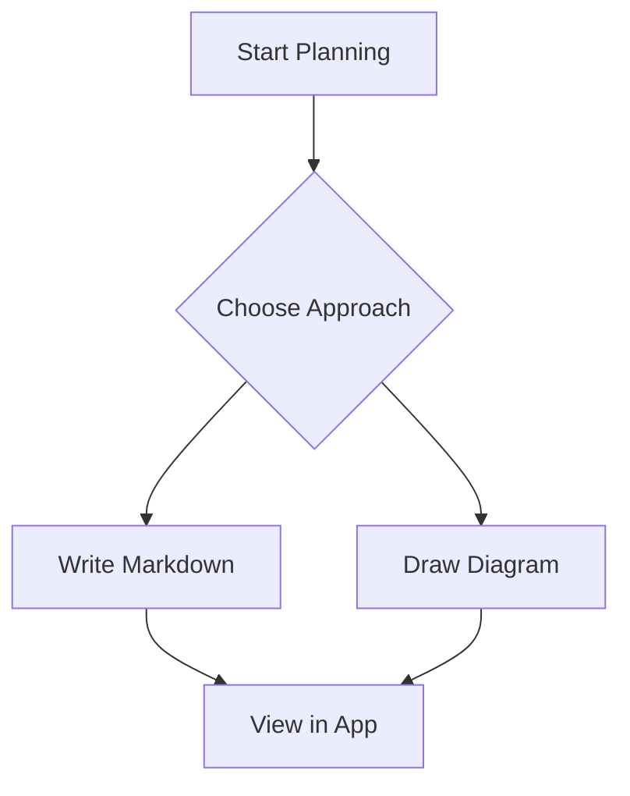
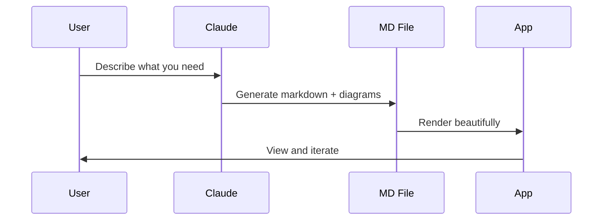

# Planning Central - Desktop Markdown & Diagram Viewer

## Context

You want a central place to hold all your planning markdown files with the ability to visualize Mermaid diagrams beautifully — like a lightweight, custom viewer that Claude can easily generate content for. The `claude_planning_central` folder is currently empty, so we're building from scratch.

**MVP scope:** File tree sidebar + markdown renderer + Mermaid diagrams + live reload. No editor, no search, no graph view — those can come in future iterations.

## Tech Stack

| Layer | Choice | Why |
|-------|--------|-----|
| Desktop framework | **Tauri 2.x** | ~5-8 MB app, ~40 MB RAM (vs Electron's 200+ MB) |
| Frontend | **Svelte 5 + TypeScript** | Smallest compiled output, reactive runes |
| Markdown parser | **marked** (~14.x) | 30KB, fastest, simple extension API |
| Diagrams | **mermaid** (~11.x) | Text-based, Claude generates easily |
| Code highlighting | **highlight.js** (~11.x) | Pure JS, no WASM, fast startup |
| File system | **Custom Rust commands** | No plugin scope restrictions, full control |
| File watching | **notify** crate (7.x) | Native OS events, cross-platform |
| Styling | **Plain CSS + Svelte scoped styles** | ~5 components don't justify Tailwind |

## Prerequisitesssssss

- Rust toolchain (`rustup`) — needed for Tauri
- Node.js 18+
- WebView2 (already on Windows 11)

## Project Structure

The Tauri app lives in `claude_planning_central/`. Markdown files go in `docs/` subfolder.

```
claude_planning_central/
├── docs/                              # YOUR MARKDOWN FILES GO HERE
│   └── test.md                        # Sample test file
├── src-tauri/                         # Rust backend
│   ├── src/
│   │   ├── main.rs                    # Entry point (scaffolded)
│   │   ├── lib.rs                     # Command registration (modify)
│   │   ├── models.rs                  # FileEntry struct
│   │   └── commands/
│   │       ├── mod.rs
│   │       ├── filesystem.rs          # read_directory_tree, read_file_contents
│   │       └── watcher.rs             # File watching via notify
│   ├── capabilities/default.json      # (scaffolded, no changes needed)
│   ├── Cargo.toml                     # Add notify = "7"
│   └── tauri.conf.json                # Window title/size
├── src/                               # Svelte frontend
│   ├── App.svelte                     # Root layout (sidebar + content grid)
│   ├── app.css                        # Global styles + markdown theme
│   ├── main.ts                        # Entry point + highlight.js theme import
│   └── lib/
│       ├── components/
│       │   ├── Sidebar.svelte         # Sidebar container with header
│       │   ├── FileTree.svelte        # Tree root wrapper
│       │   ├── FileTreeItem.svelte    # Recursive tree node (expand/collapse)
│       │   └── MarkdownViewer.svelte  # Renders MD + Mermaid + syntax highlighting
│       ├── services/
│       │   ├── filesystem.ts          # Tauri invoke() wrappers
│       │   └── markdown.ts            # marked config + mermaid extension
│       └── types.ts                   # FileEntry interface
├── index.html, package.json, vite.config.ts, etc.  # (scaffolded)
```

**11 new files** to write. Everything else comes from scaffolding.

## Implementation Steps

### Step 1: Scaffold project
```bash
npm create tauri-app@latest claude_planning_central -- --template svelte-ts
npm install
npm run tauri dev  # verify it boots
```

### Step 2: Install frontend dependencies
```bash
npm install marked mermaid highlight.js
```

### Step 3: Add Rust dependencies
Add to `src-tauri/Cargo.toml`:
```toml
notify = "7"
```

### Step 4: Write Rust backend
**`models.rs`** — `FileEntry` struct (name, path, is_directory, children)

**`commands/filesystem.rs`** — Two commands:
- `read_directory_tree(path)` — Recursively reads directory, filters to `.md` files and folders containing them, skips hidden dirs, sorts directories-first then alphabetical
- `read_file_contents(path)` — `std::fs::read_to_string()` wrapper

**`commands/watcher.rs`** — `start_watching(app_handle, path)`:
- Spawns `notify::RecommendedWatcher` in background
- Emits `"file-changed"` Tauri events to frontend
- Stores watcher in Tauri managed state to prevent drop

**`lib.rs`** — Register all commands + `WatcherState` managed state

### Step 5: TypeScript types + service layer
- `types.ts` — `FileEntry` interface mirroring Rust struct
- `services/filesystem.ts` — `readDirectoryTree()`, `readFileContents()`, `startWatching()` wrappers

### Step 6: Build App layout (`App.svelte`)
- CSS Grid: `grid-template-columns: 280px 1fr`
- State: `tree`, `selectedPath`, `fileContent` using `$state()` runes
- On mount: load tree, start watcher, listen for `"file-changed"` events
- On file change: reload tree + reload current file if it changed

### Step 7: Build FileTree components
- `Sidebar.svelte` — Container with "Files" header, scrollable content area
- `FileTree.svelte` — Thin wrapper rendering top-level entries
- `FileTreeItem.svelte` — Recursive component:
  - Folders: click to expand/collapse with chevron icon
  - Files: click to select, highlight active
  - Indentation via `depth * 16px` padding
  - Top-level folders start expanded

### Step 8: Build MarkdownViewer + markdown service
**`services/markdown.ts`:**
- Configure `marked` with custom renderer extension
- Detect `lang === 'mermaid'` code blocks → output `<pre class="mermaid">{code}</pre>`
- All other code blocks → `highlight.js` syntax highlighting
- Export `renderMarkdown()` and `renderMermaidDiagrams()` functions

**`MarkdownViewer.svelte`:**
- Receives `content` and `filePath` as props
- `$effect()` to parse markdown when content changes
- `$effect()` to call `mermaid.run()` after DOM update via `requestAnimationFrame`
- `{@html htmlContent}` for rendered output
- Empty state when no file selected

### Step 9: Global styles + highlight theme
- `app.css` — Dark theme (Catppuccin-inspired) with CSS custom properties
- Markdown content styles (`.markdown-body` class)
- Mermaid diagram container styles
- Scrollbar styling
- `main.ts` — Import `highlight.js/styles/github-dark.css`

### Step 10: Window config
Update `tauri.conf.json`: title "Planning Central", 1200x800, min 800x600

### Step 11: Create test content
Create `docs/test.md` with headings, code blocks, and Mermaid diagrams to verify everything works.

## Verification

1. `npm run tauri dev` — app opens with sidebar showing `docs/` tree
2. Click `test.md` — renders markdown with syntax-highlighted code and Mermaid SVG diagrams
3. Edit `test.md` externally — viewer auto-updates within ~1 second
4. Create new `.md` file in `docs/` — file tree updates automatically
5. Mermaid `flowchart`, `sequenceDiagram`, `stateDiagram` blocks all render as SVGs

## Sample Test File (`docs/test.md`)

````markdown
# Planning Central Test

## Code Block
```javascript
function hello() {
  console.log("Hello from Planning Central!");
}
```

## Mermaid Flowchart


## Mermaid Sequence Diagram

````
