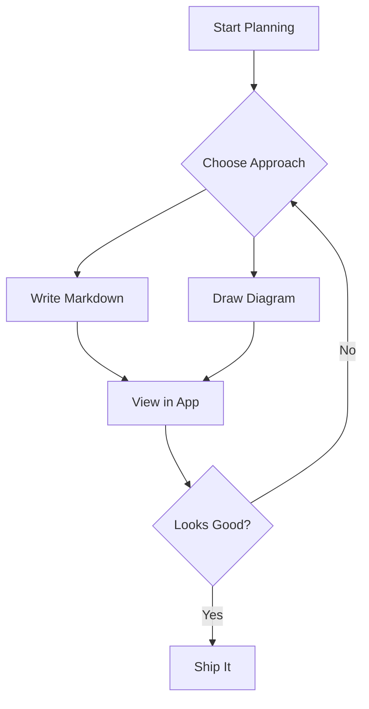
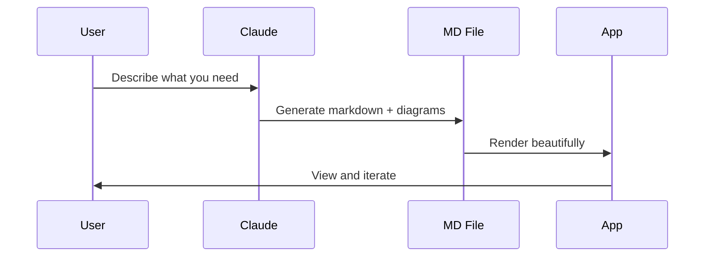
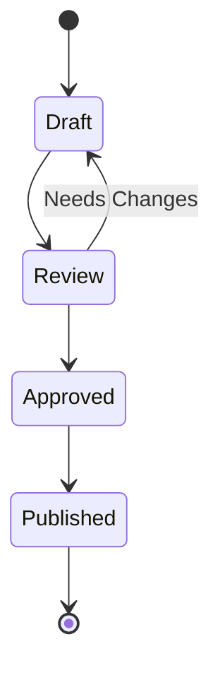

# Planning Central Test

Welcome to **Planning Central** — your local markdown viewer with diagram support.

## Code Block

```javascript
function hello() {
  console.log("Hello from Planning Central!");
}

const features = ["markdown", "mermaid", "syntax highlighting"];
features.forEach((f) => console.log(`Supports: ${f}`));
```

## Mermaid Flowchart



## Mermaid Sequence Diagram



## Mermaid State Diagram



## Table Example

| Feature | Status | Notes |
|---------|--------|-------|
| File tree sidebar | Done | Recursive, filterable |
| Markdown rendering | Done | Full GFM support |
| Mermaid diagrams | Done | Flowchart, sequence, state |
| Live reload | Done | File watcher via notify |
| Dark theme | Done | Catppuccin-inspired |

## Blockquote

> Planning is bringing the future into the present so that you can do something about it now.
> — Alan Lakein

## Lists

### Unordered
- File tree with expand/collapse
- Syntax highlighted code blocks
- Multiple Mermaid diagram types
- Auto-reload on file changes

### Ordered
1. Open the app
2. Browse markdown files in the sidebar
3. Click to view rendered content
4. Edit files externally — they auto-refresh

## Inline Code

Use `npm run tauri dev` to start the development server. The app runs on `localhost:1420`.

---

*This is a test file for verifying all rendering features work correctly.*
