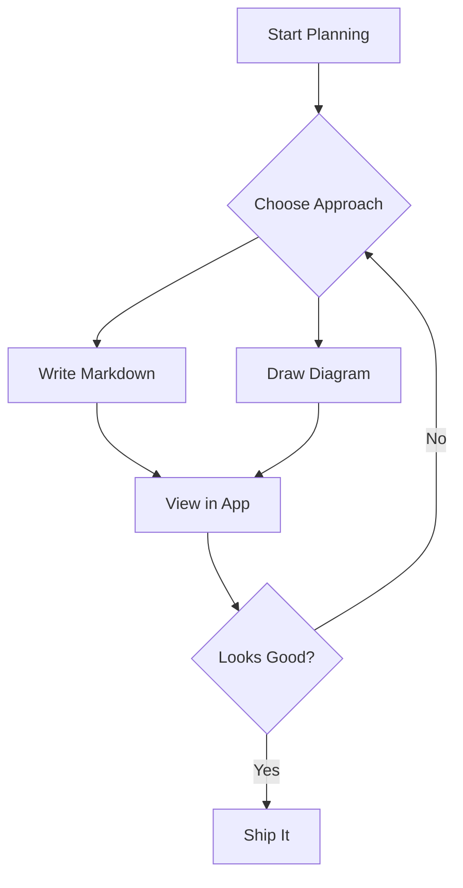
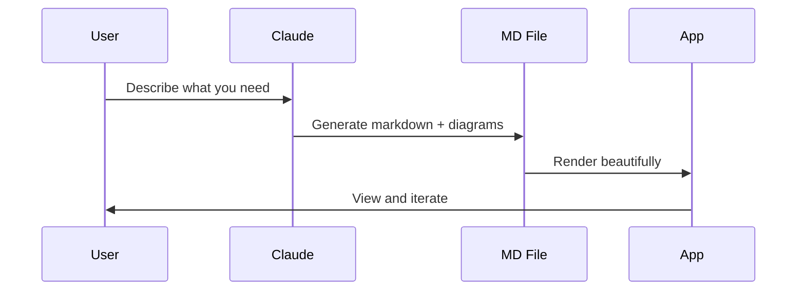
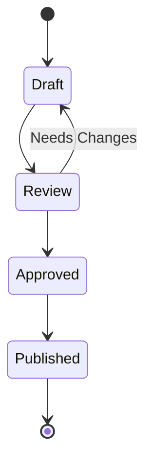
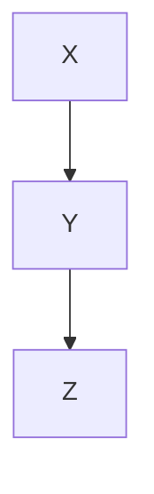

# Glacimark Rendering Museum

Welcome to **Glacimark** — your local markdown viewer with diagram support. This file showcases every rendering feature so you can verify they all work correctly.

For more information about how the application works, see [How to Use Glacimark](<How to Use Glacimark.md>).

---

## Images

### Relative Path (Local Image)


### External URL


### Image Paste/Drop (Editor Feature)

To test: open this file in edit mode (Ctrl+E), then paste a screenshot (Ctrl+V) or drag an image file onto the editor. An `assets/` folder will be created next to this file, and a markdown image reference will be inserted at the cursor. The image should appear in the preview pane immediately.

### Broken Image (Graceful Degradation)


---

## Code Blocks

### JavaScript (Syntax Highlighted + Line Numbers)

```javascript
function hello() {
  console.log("Hello from Glacimark!");
}

const features = ["markdown", "mermaid", "syntax highlighting", "images"];
features.forEach((f) => console.log(`Supports: ${f}`));
```

### Rust

```rust
fn main() {
    let name = "Glacimark";
    println!("Welcome to {}!", name);

    let features = vec!["file tree", "live reload", "dark theme"];
    for feature in &features {
        println!("  - {}", feature);
    }
}
```

### TypeScript

```typescript
interface Feature {
  name: string;
  status: "done" | "planned";
}

const features: Feature[] = [
  { name: "Markdown rendering", status: "done" },
  { name: "Image support", status: "done" },
];
```

### JSON

```json
{
  "app": "Glacimark",
  "version": "0.1.0",
  "features": ["markdown", "mermaid", "svgbob", "images", "search"]
}
```

---

## Mermaid Diagrams

### Flowchart



### Sequence Diagram



### State Diagram



### Intentionally Broken Mermaid (Error Display)

This block has invalid syntax to showcase the error overlay. You should see a red-bordered block with an error message instead of a rendered diagram. In **edit mode**, the mermaid code will have a red wavy underline (lint error):

```mermaid
flowchart INVALID
    A--->>>B
    this is not valid mermaid syntax !!!
    C --> D --> --> E
```

---

## ASCII Art / Svgbob Diagrams

### Explicitly Tagged

```bob
    ┌──────────┐     ┌──────────┐     ┌──────────┐
    │  Tauri   │────>│  Svelte  │────>│  Viewer  │
    │ Backend  │     │ Frontend │     │  Output  │
    └──────────┘     └──────────┘     └──────────┘
```

### Auto-Detected (Unicode Box-Drawing)

```
┌─────────────────────────────────┐
│       Glacimark          │
├────────────┬────────────────────┤
│  Sidebar   │   Content Area     │
│            │                    │
│  ├── docs/ │   Rendered         │
│  │   └─ *.md   Markdown         │
│  └── img/  │                    │
│            │   + Diagrams       │
│            │   + Images         │
└────────────┴────────────────────┘
```

### File Tree (Auto-Detected)

```
├── src/
│   ├── lib/
│   │   ├── components/
│   │   └── services/
│   └── main.ts
├── src-tauri/
│   └── src/
│       └── commands/
├── docs/
│   └── test.md
└── img/
    └── logo.png
```

---

## Tables

### Compact Table (fits in view)

| Feature | Status | Notes |
|---------|--------|-------|
| File tree sidebar | Done | Recursive, filterable |
| Markdown rendering | Done | Full GFM support |
| Mermaid diagrams | Done | Flowchart, sequence, state |
| Svgbob diagrams | Done | ASCII art to SVG |
| Live reload | Done | File watcher via notify |
| Dark theme | Done | Catppuccin-inspired |
| Multi-pane viewing | Done | Up to 4 panes |
| Full-text search | Done | With highlight + scroll |
| Image rendering | Done | Local + external + broken fallback |

### Wide Table (horizontal scroll)

The table below has many columns and should scroll horizontally instead of overflowing off-screen.

| Component | Language | Framework | Build Tool | Test Framework | Lines of Code | Status | Owner | Priority | Sprint | Dependencies | Notes |
|-----------|----------|-----------|------------|----------------|---------------|--------|-------|----------|--------|--------------|-------|
| FileTree | TypeScript | Svelte 5 | Vite 6 | vitest + testing-library | ~250 | Complete | Frontend Team | P0 | Sprint 1 | tree-utils, persistence | Keyboard nav with arrow keys, expand/collapse |
| MarkdownViewer | TypeScript | Svelte 5 | Vite 6 | vitest + testing-library | ~220 | Complete | Frontend Team | P0 | Sprint 1 | markdown service, highlight service | Renders HTML from marked, triggers mermaid/bob |
| Sidebar | TypeScript | Svelte 5 | Vite 6 | vitest + testing-library | ~180 | Complete | Frontend Team | P0 | Sprint 1 | FileTree, SearchResults, filesystem | Filter bar, search toggle, sort controls |
| ContentArea | TypeScript | Svelte 5 | Vite 6 | vitest + testing-library | ~150 | Complete | Frontend Team | P1 | Sprint 2 | MarkdownViewer, persistence | Multi-pane CSS grid layout, Ctrl+Click to open |
| filesystem.rs | Rust | Tauri 2.10 | Cargo | cargo test | ~200 | Complete | Backend Team | P0 | Sprint 1 | walkdir, serde | Directory tree, file reading, full-text search |
| watcher.rs | Rust | Tauri 2.10 | Cargo | cargo test | ~100 | Complete | Backend Team | P0 | Sprint 1 | notify 7 | Native file system watcher, emits Tauri events |
| diagram.rs | Rust | Tauri 2.10 | Cargo | cargo test | ~50 | Complete | Backend Team | P1 | Sprint 2 | svgbob 0.7 | ASCII art to SVG conversion with dark theme colors |

---

## Text Formatting

This paragraph has **bold text**, *italic text*, and ***bold italic***. Here is some `inline code` and a [link to GitHub](https://github.com/zacharysarette/planning-central).

---

## Blockquote

> Planning is bringing the future into the present so that you can do something about it now.
> — Alan Lakein

---

## Lists

### Unordered

- File tree with expand/collapse
- Syntax highlighted code blocks with line numbers
- Multiple Mermaid diagram types
- Svgbob ASCII art rendering
- Local and external image support
- Auto-reload on file changes

### Ordered

1. Open the app
2. Browse markdown files in the sidebar
3. Click to view rendered content
4. Edit files externally — they auto-refresh
5. Use the search to find text across all files

---

## Horizontal Rules

Content above the rule.

---

Content below the rule.

---

## File Links (Cross-File Navigation)

Clicking a `.md` link opens that file in the active pane. Ctrl+Click opens it in a new pane. Links with `#section` fragments open the file and scroll to the heading.

- [Open the user guide](How to Use Glacimark.md) (should open in active pane)
- [Open nextsteps](nextsteps.md) (relative file link)

### External Links

External `http://` and `https://` links open in your system browser instead of navigating the WebView:

- [Glacimark on GitHub](https://github.com/zacharysarette/glacimark) (opens in browser)
- [Example.com](https://example.com) (opens in browser)

### Malformed Links

These intentionally broken link syntaxes should render as plain text, not clickable links:

- [Spaces in URL](How to Use Glacimark.md) — spaces break the URL per CommonMark spec
- [Missing closing paren](test.md — no closing `)` on the URL
- [Empty URL]() — empty destination
- Just brackets with no parens: [not a link]

To link to filenames with spaces, use angle brackets: `[link text](<file with spaces.md>)`.

---

## Anchor Links (In-Page Navigation)

Clicking a `#hash` link smooth-scrolls to the matching heading. Try these — each should visibly scroll since they jump across the full length of this document:

- [Jump to Images](#images) (near the top)
- [Jump to Code Blocks](#code-blocks)
- [Jump to Mermaid Diagrams](#mermaid-diagrams)
- [Jump to ASCII Art](#ascii-art--svgbob-diagrams)
- [Jump to Tables](#tables)
- [Jump to Text Formatting](#text-formatting)
- [Back to top](#glacimark-rendering-museum)
- [Back to User Guide](<How to Use Glacimark.md>) (opens the help guide)

---

## Jump List (Windows Taskbar)

Right-click the Glacimark icon in the Windows taskbar to see **Recent Folders**. To test:

1. Open 3 different folders using the folder picker
2. Right-click the taskbar icon — all 3 should appear under "Recent Folders"
3. Delete one of the folders on disk, then relaunch the app — the stale folder should disappear
4. Click a folder in the jump list — the app should switch to that folder

---

## Multi-Window

Glacimark supports multiple independent windows. To test:

1. **Ctrl+Shift+N** or **File > New Window** — a second window should open with the correct theme
2. Each window should independently browse folders, open files, and manage panes
3. Editing a file in one window should update it in all other open windows (file watcher sync)
4. Closing one window should leave others running; closing the last window exits the app

---

## Source Line Numbers

Click the **1:** button in the header to toggle source line numbers. Each block element should show its source line number in the left gutter:

- This paragraph should show a line number
- The heading above should show its line number
- Code blocks, blockquotes, tables, and horizontal rules all get line numbers

> This blockquote should have a line number in the gutter.

| Element | Expected |
|---------|----------|
| Heading | Line number matches source |
| Paragraph | Line number matches source |
| Code block | Line number matches source |

```python
# This code block should show a source line number too
def hello():
    print("world")
```

Toggle off — all gutter numbers should disappear.

---

## Editor Line Wrapping

Open this file in **edit mode** (pencil icon) to test line wrapping. The following line is intentionally very long:

This is an extremely long line that should demonstrate how line wrapping works in the CodeMirror editor pane. When wrapping is enabled (the default), this text should wrap to fit within the editor width without any horizontal scrollbar. When wrapping is disabled by clicking the ⏎ button in the editor header, this line should extend past the visible area and require horizontal scrolling to read the full content. Toggle the ⏎ button to switch between wrapped and unwrapped modes. The setting persists across sessions.

- With wrapping **on** (⏎ button highlighted): the long line above wraps within the editor
- With wrapping **off** (⏎ button dim): horizontal scrollbar appears, line extends offscreen

---

## Mermaid Auto-Fix

The blocks below are **intentionally broken** to test Glacimark's auto-fix feature. Click "Try Auto-Fix" in the error banner (view mode) or the wrench button / Ctrl+Shift+F (edit mode) to repair them.

### Missing Diagram Type

```mermaid
A --> B
B --> C
```

### Single-Dash Arrows

```mermaid
graph TD
  Start -> Process
  Process -> End
```

### Bare Graph Keyword (No Direction)



### Unclosed Subgraph

```mermaid
graph TD
  subgraph Backend
    API --> DB
```

### Combined Issues

```mermaid
subgraph Services
  Auth -> Users
  Users -> DB
```

---

## Undo / Redo

Glacimark tracks file operations so you can undo mistakes with **Ctrl+Z** and redo with **Ctrl+Shift+Z** or **Ctrl+Y**.

### Test Scenarios

1. **Create a file** (Ctrl+N, name it "undo-test") -- then Ctrl+Z: the file should disappear from the tree
2. **Delete a file** (Delete key on a file) -- then Ctrl+Z: the file should reappear with its original content
3. **Rename a file** (F2 on a file, change the name) -- then Ctrl+Z: the old name should be restored
4. **Move a file** (drag it to another folder) -- then Ctrl+Z: the file should return to its original location
5. **Edit and save a file** -- then close editor, Ctrl+Z: the previous content should be restored
6. **Multiple undo/redo chain** -- perform several operations, then Ctrl+Z multiple times, then Ctrl+Shift+Z to redo

**Note:** When the CodeMirror editor is focused, Ctrl+Z uses the editor's built-in character-level undo. Outside the editor, Ctrl+Z undoes the last app-level file operation. Deleted files are moved to the Recycle Bin for extra safety.

---

## Table of Contents

Press **Ctrl+T** to toggle the Table of Contents pane. The TOC appears as a grid pane on the left side of the content area.

### Test Scenarios

1. **Toggle TOC** -- press Ctrl+T: a TOC pane should appear on the left side of the content area showing all headings from this document
2. **Click an entry** -- click any heading in the TOC: the viewer should scroll to that section and the TOC highlight should stay stable (no jitter during scroll)
3. **Active heading tracking** -- scroll through the document: after ~1 second, the currently visible heading should be highlighted in the TOC
4. **Switch panes** -- open a different file in another pane, then switch back: the TOC should update to reflect the active pane's content
5. **Close TOC** -- click the x button on the TOC pane header, or press Ctrl+T again: the TOC pane should close and file panes should expand to fill the space
6. **Persistence** -- close and reopen the app: the TOC visibility state should be remembered
7. **Does not count toward pane limit** -- open 4 file panes, then toggle TOC: the TOC should appear alongside all 4 panes
8. **Duplicate headings** -- this file has a "Test Scenarios" heading under both "Table of Contents" and other sections: clicking each one in the TOC should scroll to the correct one

---

## Find & Replace

In edit mode, press **Ctrl+F** to open the find panel, or **Ctrl+H** for find & replace. The search panel is styled to match both Aurora and Glacier themes.

### Test Scenarios

1. **Open find panel** -- enter edit mode (Ctrl+E), then press Ctrl+F: a themed search panel should appear at the top of the editor
2. **Search highlight** -- type a search term: all matches should be highlighted with an amber background, the active match should be brighter
3. **Replace** -- press Ctrl+H: both find and replace inputs should be visible, styled consistently with the theme
4. **Theme switching** -- switch themes while the search panel is open: colors should update to match the new theme
5. **Close panel** -- press Escape: the search panel should close

---

## Wiki-style Links

Glacimark supports wiki-style `[[links]]` for linking between markdown files. They render with a dashed underline to distinguish them from regular links.

### Examples

- Basic link: [[How to Use Glacimark]]
- With .md extension: [[How to Use Glacimark.md]]
- With alias: [[How to Use Glacimark|the user guide]]
- Non-existent file: [[imaginary page]]

### Test Scenarios

1. **Click a wiki-link** -- click [[How to Use Glacimark]] above: the user guide should open in the active pane
2. **Alias display** -- the third link above should show "the user guide" as its text, not the filename
3. **Dashed underline** -- wiki-links should have a purple dashed underline (not solid like regular links)
4. **Code blocks** -- wiki-link syntax inside `[[code]]` or fenced code blocks should NOT be rendered as links
5. **Ctrl+Click** -- Ctrl+Click a wiki-link to open it in a new pane

---

## Backlinks

When other files in the current folder link to the current file using `[[wiki-links]]`, a "backlinks" panel appears at the bottom of the viewer.

### Test Scenarios

1. **Backlinks appear** -- open a file that other files link to via `[[links]]`: a collapsed "N backlinks" footer should appear below the content
2. **Expand backlinks** -- click the backlinks header: it should expand to show the linking files with context lines
3. **Navigate** -- click a file name in the expanded backlinks: the app should navigate to that file
4. **No backlinks** -- open a file that nothing links to: no backlinks footer should appear
5. **Read-only/help** -- open the help doc (? button): no backlinks should appear for embedded docs

---

## Document Statistics Footer

Press **Ctrl+I** or click the **Aa** button in the viewer header to toggle the document statistics bar. It appears as a slim footer between the article content and the backlinks panel.

### What to Verify

1. **Toggle** -- press Ctrl+I: the stats bar should appear/disappear at the bottom of the viewer
2. **Aa button** -- click the "Aa" button in the viewer header: same toggle behavior
3. **Stats values** -- the bar shows: words, chars, chars (no spaces), lines, sentences, paragraphs, reading time, FRE score, FK grade
4. **Tooltips** -- hover over "FRE" and "FK" values: tooltips should explain the scales
5. **Persistence** -- toggle stats on, close and reopen the app: stats should still be visible
6. **Theme** -- switch between Aurora and Glacier: the stats bar should match the theme (uses `--text-muted` and `--border` CSS variables)
7. **Edit mode** -- enter edit mode (Ctrl+E): the stats bar should NOT appear
8. **Empty file** -- view an empty or whitespace-only file: the stats bar should be hidden even when toggled on
9. **CodeMirror guard** -- in edit mode, Ctrl+I should trigger italic formatting (not toggle stats)

---

*This file is a rendering museum — every feature of Glacimark displayed in one place.*
