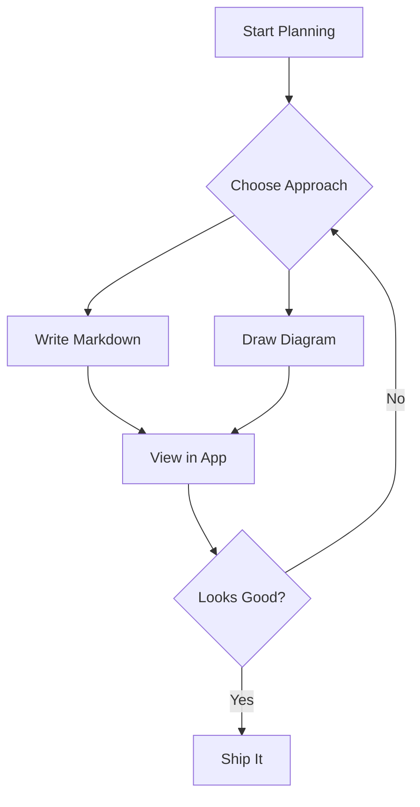
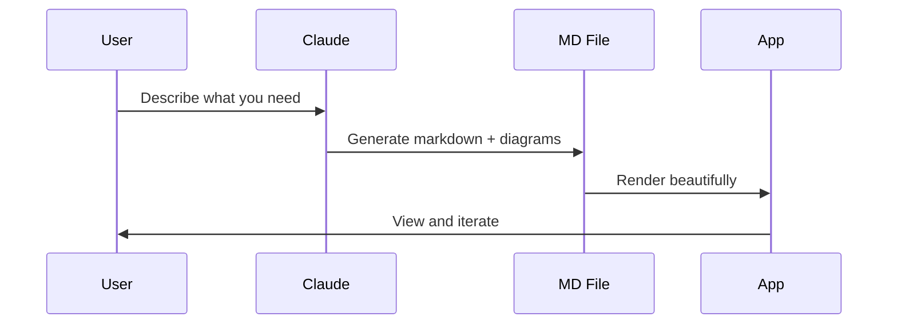
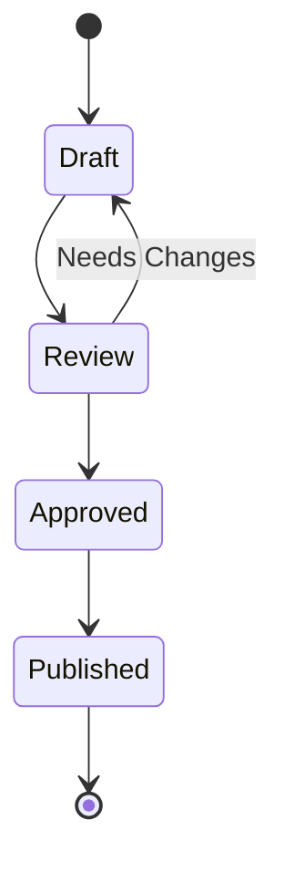

# Glacimark Rendering Museum

Welcome to **Glacimark** — your local markdown viewer with diagram support. This file showcases every rendering feature so you can verify they all work correctly.

For more information about how the application works, see [How to Use Glacimark](<How to Use Glacimark.md>).

---

## Images

### Relative Path (Local Image)


### External URL


### Broken Image (Graceful Degradation)


---

## Code Blocks

### JavaScript (Syntax Highlighted + Line Numbers)

```javascript
function hello() {
  console.log("Hello from Glacimark!");
}

const features = ["markdown", "mermaid", "syntax highlighting", "images"];
features.forEach((f) => console.log(`Supports: ${f}`));
```

### Rust

```rust
fn main() {
    let name = "Glacimark";
    println!("Welcome to {}!", name);

    let features = vec!["file tree", "live reload", "dark theme"];
    for feature in &features {
        println!("  - {}", feature);
    }
}
```

### TypeScript

```typescript
interface Feature {
  name: string;
  status: "done" | "planned";
}

const features: Feature[] = [
  { name: "Markdown rendering", status: "done" },
  { name: "Image support", status: "done" },
];
```

### JSON

```json
{
  "app": "Glacimark",
  "version": "0.1.0",
  "features": ["markdown", "mermaid", "svgbob", "images", "search"]
}
```

---

## Mermaid Diagrams

### Flowchart



### Sequence Diagram



### State Diagram



### Intentionally Broken Mermaid (Error Display)

This block has invalid syntax to showcase the error overlay. You should see a red-bordered block with an error message instead of a rendered diagram. In **edit mode**, the mermaid code will have a red wavy underline (lint error):

```mermaid
flowchart INVALID
    A--->>>B
    this is not valid mermaid syntax !!!
    C --> D --> --> E
```

---

## ASCII Art / Svgbob Diagrams

### Explicitly Tagged

```bob
    ┌──────────┐     ┌──────────┐     ┌──────────┐
    │  Tauri   │────>│  Svelte  │────>│  Viewer  │
    │ Backend  │     │ Frontend │     │  Output  │
    └──────────┘     └──────────┘     └──────────┘
```

### Auto-Detected (Unicode Box-Drawing)

```
┌─────────────────────────────────┐
│       Glacimark          │
├────────────┬────────────────────┤
│  Sidebar   │   Content Area     │
│            │                    │
│  ├── docs/ │   Rendered         │
│  │   └─ *.md   Markdown         │
│  └── img/  │                    │
│            │   + Diagrams       │
│            │   + Images         │
└────────────┴────────────────────┘
```

### File Tree (Auto-Detected)

```
├── src/
│   ├── lib/
│   │   ├── components/
│   │   └── services/
│   └── main.ts
├── src-tauri/
│   └── src/
│       └── commands/
├── docs/
│   └── test.md
└── img/
    └── logo.png
```

---

## Tables

### Compact Table (fits in view)

| Feature | Status | Notes |
|---------|--------|-------|
| File tree sidebar | Done | Recursive, filterable |
| Markdown rendering | Done | Full GFM support |
| Mermaid diagrams | Done | Flowchart, sequence, state |
| Svgbob diagrams | Done | ASCII art to SVG |
| Live reload | Done | File watcher via notify |
| Dark theme | Done | Catppuccin-inspired |
| Multi-pane viewing | Done | Up to 4 panes |
| Full-text search | Done | With highlight + scroll |
| Image rendering | Done | Local + external + broken fallback |

### Wide Table (horizontal scroll)

The table below has many columns and should scroll horizontally instead of overflowing off-screen.

| Component | Language | Framework | Build Tool | Test Framework | Lines of Code | Status | Owner | Priority | Sprint | Dependencies | Notes |
|-----------|----------|-----------|------------|----------------|---------------|--------|-------|----------|--------|--------------|-------|
| FileTree | TypeScript | Svelte 5 | Vite 6 | vitest + testing-library | ~250 | Complete | Frontend Team | P0 | Sprint 1 | tree-utils, persistence | Keyboard nav with arrow keys, expand/collapse |
| MarkdownViewer | TypeScript | Svelte 5 | Vite 6 | vitest + testing-library | ~220 | Complete | Frontend Team | P0 | Sprint 1 | markdown service, highlight service | Renders HTML from marked, triggers mermaid/bob |
| Sidebar | TypeScript | Svelte 5 | Vite 6 | vitest + testing-library | ~180 | Complete | Frontend Team | P0 | Sprint 1 | FileTree, SearchResults, filesystem | Filter bar, search toggle, sort controls |
| ContentArea | TypeScript | Svelte 5 | Vite 6 | vitest + testing-library | ~150 | Complete | Frontend Team | P1 | Sprint 2 | MarkdownViewer, persistence | Multi-pane CSS grid layout, Ctrl+Click to open |
| filesystem.rs | Rust | Tauri 2.10 | Cargo | cargo test | ~200 | Complete | Backend Team | P0 | Sprint 1 | walkdir, serde | Directory tree, file reading, full-text search |
| watcher.rs | Rust | Tauri 2.10 | Cargo | cargo test | ~100 | Complete | Backend Team | P0 | Sprint 1 | notify 7 | Native file system watcher, emits Tauri events |
| diagram.rs | Rust | Tauri 2.10 | Cargo | cargo test | ~50 | Complete | Backend Team | P1 | Sprint 2 | svgbob 0.7 | ASCII art to SVG conversion with dark theme colors |

---

## Text Formatting

This paragraph has **bold text**, *italic text*, and ***bold italic***. Here is some `inline code` and a [link to GitHub](https://github.com/zacharysarette/planning-central).

---

## Blockquote

> Planning is bringing the future into the present so that you can do something about it now.
> — Alan Lakein

---

## Lists

### Unordered

- File tree with expand/collapse
- Syntax highlighted code blocks with line numbers
- Multiple Mermaid diagram types
- Svgbob ASCII art rendering
- Local and external image support
- Auto-reload on file changes

### Ordered

1. Open the app
2. Browse markdown files in the sidebar
3. Click to view rendered content
4. Edit files externally — they auto-refresh
5. Use the search to find text across all files

---

## Horizontal Rules

Content above the rule.

---

Content below the rule.

---

## File Links (Cross-File Navigation)

Clicking a `.md` link opens that file in the active pane. Ctrl+Click opens it in a new pane. Links with `#section` fragments open the file and scroll to the heading.

- [Open the user guide](How to Use Glacimark.md) (should open in active pane)
- [Open nextsteps](nextsteps.md) (relative file link)

### External Links

External `http://` and `https://` links open in your system browser instead of navigating the WebView:

- [Glacimark on GitHub](https://github.com/zacharysarette/glacimark) (opens in browser)
- [Example.com](https://example.com) (opens in browser)

### Malformed Links

These intentionally broken link syntaxes should render as plain text, not clickable links:

- [Spaces in URL](How to Use Glacimark.md) — spaces break the URL per CommonMark spec
- [Missing closing paren](test.md — no closing `)` on the URL
- [Empty URL]() — empty destination
- Just brackets with no parens: [not a link]

To link to filenames with spaces, use angle brackets: `[link text](<file with spaces.md>)`.

---

## Anchor Links (In-Page Navigation)

Clicking a `#hash` link smooth-scrolls to the matching heading. Try these — each should visibly scroll since they jump across the full length of this document:

- [Jump to Images](#images) (near the top)
- [Jump to Code Blocks](#code-blocks)
- [Jump to Mermaid Diagrams](#mermaid-diagrams)
- [Jump to ASCII Art](#ascii-art--svgbob-diagrams)
- [Jump to Tables](#tables)
- [Jump to Text Formatting](#text-formatting)
- [Back to top](#glacimark-rendering-museum)
- [Back to User Guide](<How to Use Glacimark.md>) (opens the help guide)

---

## Jump List (Windows Taskbar)

Right-click the Glacimark icon in the Windows taskbar to see **Recent Folders**. To test:

1. Open 3 different folders using the folder picker
2. Right-click the taskbar icon — all 3 should appear under "Recent Folders"
3. Delete one of the folders on disk, then relaunch the app — the stale folder should disappear
4. Click a folder in the jump list — the app should switch to that folder

---

## Multi-Window

Glacimark supports multiple independent windows. To test:

1. **Ctrl+Shift+N** or **File > New Window** — a second window should open with the correct theme
2. Each window should independently browse folders, open files, and manage panes
3. Editing a file in one window should update it in all other open windows (file watcher sync)
4. Closing one window should leave others running; closing the last window exits the app

---

## Source Line Numbers

Click the **1:** button in the header to toggle source line numbers. Each block element should show its source line number in the left gutter:

- This paragraph should show a line number
- The heading above should show its line number
- Code blocks, blockquotes, tables, and horizontal rules all get line numbers

> This blockquote should have a line number in the gutter.

| Element | Expected |
|---------|----------|
| Heading | Line number matches source |
| Paragraph | Line number matches source |
| Code block | Line number matches source |

```python
# This code block should show a source line number too
def hello():
    print("world")
```

Toggle off — all gutter numbers should disappear.

---

*This file is a rendering museum — every feature of Glacimark displayed in one place.*
